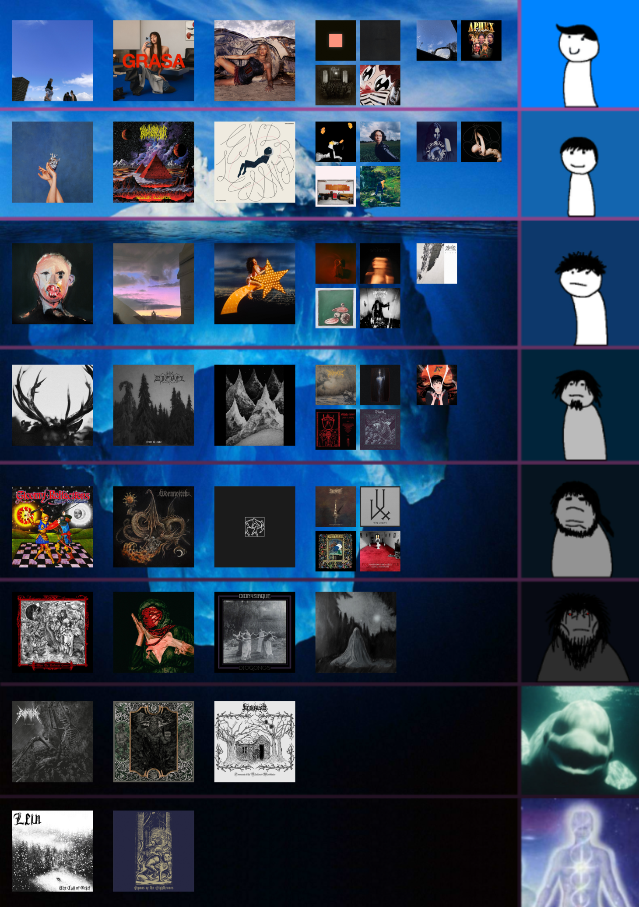

# music-playlist-iceberg
The `music-playlist-iceberg` application visualises albums in a Spotify playlist as an iceberg. Try the app [here](https://spotify-playlist-iceberg.streamlit.app/).

By providing the url of a Spotify playlist, this app will fetch album data from the playlist (including album popularity and album art) and overlay albums accordingly within tiers. Albums are ordered according to popularity scores from left to right. 

For more information about how the popularity scores are calculated, refer to this [documentation page](https://developer.spotify.com/documentation/web-api/reference/get-several-tracks#:~:text=of%20the%20track.-,popularity,-integer).

## Expected Output

## Future Improvements
- *Extend the app to visualise YouTube playlists.*